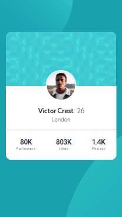

# Frontend Mentor - Profile card component solution

This is a solution to the [Profile card component challenge on Frontend Mentor](https://www.frontendmentor.io/challenges/profile-card-component-cfArpWshJ). Frontend Mentor challenges help you improve your coding skills by building realistic projects.

## Table of contents

- [Overview](#overview)
  - [The challenge](#the-challenge)
  - [Screenshot](#screenshot)
  - [Links](#links)
  - [Built with](#built-with)
- [Author](#author)

## Overview

### The challenge

- Build out the project to the designs provided

### Screenshot

### Links

- Solution URL: [GitHub](https://github.com/hariscs/profile-card)
- Live Site URL: [Netlify](https://pro-card.netlify.app/)

### Built with

- Semantic HTML5 markup
- CSS custom properties
- FlexBox
- Mobile-first workflow

## Author

- Website - [Haris Shah](https://hariss.netlify.app/)
- Frontend Mentor - [@hariscs](https://www.frontendmentor.io/profile/hariscs)
- Twitter - [@\_haris_shah](https://twitter.com/_haris_shah)
